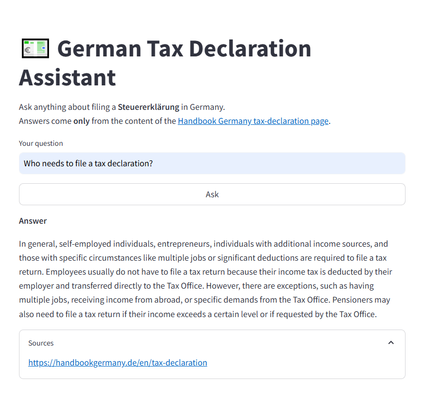

# 🇩🇪 German Tax Declaration RAG-based Chatbot

A [Streamlit](https://streamlit.io/) app that answers questions about filing a **Steuererklärung** (German tax declaration) using only the content of [HandbookGermany.de – Tax Declaration](https://handbookgermany.de/en/tax-declaration).

Powered by **Retrieval‑Augmented Generation (RAG)** with [LangChain](https://python.langchain.com/), a **FAISS** vector database, and your choice of:

- **OpenAI** chat models (GPT‑3.5/4) – _or_
- **Local Llama‑cpp** models (Llama 2, Mistral, Phi‑2 …) – fully offline.

| Feature                                     | ✔️  |
| ------------------------------------------- | --- |
| One‑click scrape & index of the target page | ✅  |
| Conversational memory                       | ✅  |
| Model swap via environment var              | ✅  |
| Persistent FAISS index                      | ✅  |
| Runs on CPU or GPU                          | ✅  |

---

## 🎥 Video demo

This is a screenshot of an actual answer of the app:

```markdown

```

## 📸 Demo

This is a screenshot of an actual answer of the app:



```
streamlit run tax_declaration_chatbot.py
```

---

## 🚀 Quick start (OpenAI backend)

```bash
# 1 Clone
 git clone https://github.com/yourname/tax-declaration-chatbot.git
 cd tax-declaration-chatbot

# 2 Create venv & install deps
 python -m venv venv && source venv/bin/activate    # Windows: venv\Scripts\activate
 pip install -r requirements.txt

# 3 Add your OpenAI key
 export OPENAI_API_KEY="sk-…"                     # Windows PowerShell: $Env:OPENAI_API_KEY = "sk-…"

# 4 Run
 streamlit run tax_declaration_chatbot.py
```

The first question triggers a web‑scrape and builds `data/faiss_index/` (few seconds). Subsequent runs load the index instantly.

---

## ⚡ Quick start (local Llama‑cpp backend)

```bash
# 1 Install llama‑cpp Python wheel (CPU‑only example)
pip install llama-cpp-python==0.2.34 \
    --extra-index-url https://abetlen.github.io/llama-cpp-python/whl/cpu

# 2 Download a quantised GGUF weight (~6 GB RAM)
mkdir -p models
wget https://huggingface.co/TheBloke/Llama-2-7B-Chat-GGUF/resolve/main/llama-2-7b-chat.Q4_K_M.gguf \
     -O models/llama-2-7b-chat.gguf

# 3 Point the app to the model
export LLAMA_CPP_MODEL="$(pwd)/models/llama-2-7b-chat.gguf"   # Windows: setx LLAMA_CPP_MODEL C:\path\to\…

# 4 (One‑time) rebuild the vector store
rm -rf data/faiss_index

# 5 Run
streamlit run tax_declaration_chatbot.py
```

Leave `OPENAI_API_KEY` **unset** and the script automatically uses the local model.

---

## 🛠️ Detailed setup

### 1 Requirements

- Python ≥ 3.9
- `pip`, `virtualenv`/`venv`
- 2 GB disk for repo + index + model
- **OpenAI plan** _or_ \~6–8 GB RAM for a 7‑B Llama quant

### 2 Install dependencies

```bash
pip install -r requirements.txt          # base deps (Streamlit, LangChain, FAISS, requests…)
# Optional – local models
pip install llama-cpp-python             # CPU build
# Or GPU build: see README section above
```

### 3 Environment variables

| Variable          | When required       | Example                           |
| ----------------- | ------------------- | --------------------------------- |
| `OPENAI_API_KEY`  | Using OpenAI models | `sk-…`                            |
| `LLAMA_CPP_MODEL` | Using llama‑cpp     | `/full/path/llama-2-7b-chat.gguf` |

### 4 Vector store

- Stored at \`\`.
- To force a fresh scrape/index run: `rm -rf data/faiss_index`.

### 5 Run / Develop

```bash
streamlit run tax_declaration_chatbot.py --server.headless false
```

Hot‑reload kicks in when you edit the file.

### 6 Docker (optional)

```dockerfile
FROM python:3.11-slim
WORKDIR /app
COPY . /app
RUN pip install -r requirements.txt \
    && pip install llama-cpp-python --extra-index-url https://abetlen.github.io/llama-cpp-python/whl/cpu
ENV LLAMA_CPP_MODEL=/app/models/llama-2-7b-chat.gguf
EXPOSE 8501
CMD ["streamlit", "run", "tax_declaration_chatbot.py", "--server.port", "8501", "--server.address", "0.0.0.0"]
```

---

## 📂 Project structure

```
.
├── tax_declaration_chatbot.py   # main Streamlit + RAG script
├── requirements.txt            # pip deps
├── README.md
├── data/                       # scraped text + FAISS index (auto‑created)
└── models/                      # GGUF weights (if using llama‑cpp)
```

---

## 🤝 Contributing

1. Fork & create a feature branch.
2. Run `black . && isort .` before committing.
3. Open a PR—describe your change and reference an issue if applicable.

---

## 📜 License

[MIT](LICENSE) – free for personal & commercial use. The HandbookGermany page content is used under its original license; check their site for details.

---

## 🙏 Credits

- [Handbook Germany](https://handbookgermany.de/) for the excellent tax‑declaration guide.
- [LangChain](https://github.com/langchain-ai/langchain) + [FAISS](https://github.com/facebookresearch/faiss) for the RAG plumbing.
- [TheBloke](https://huggingface.co/TheBloke) for maintaining community GGUF quantisations.
